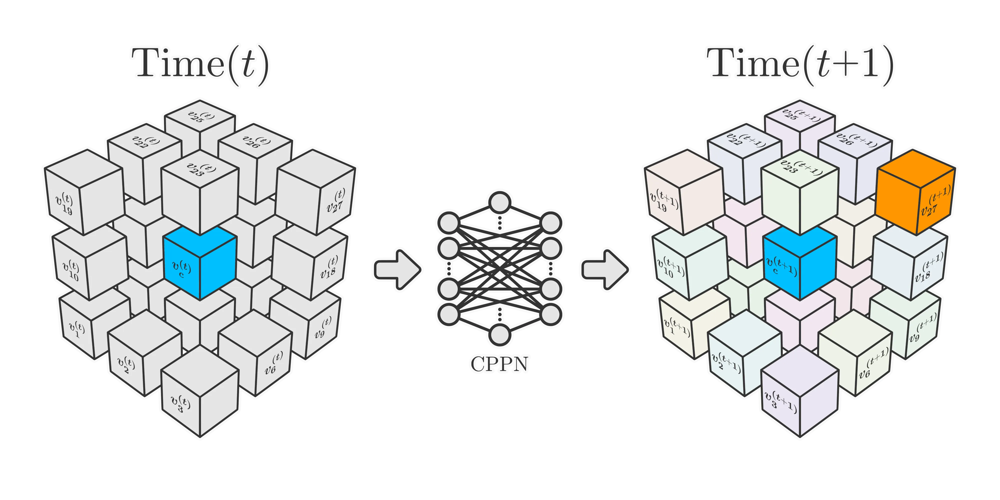

> <b>Abstract:</b>
> **LLMs** and **embodied humanoid robots** are currently highly popular, but their essence remains a black-box tool that generates static mappings based on inputs. This research plan seeks an alternative path. Through **open-ended evolution** and by **discarding excessive artificial engineering intervention**, it explores the **emergence** of **behavioral patterns** and **features** from scratch, leading to the **birth of artificial life**. The goal is to make artificial life an interesting **species** that is **deeply integrated with its environment**, possessing **structural diversity**, **spontaneity**, and **environmental adaptability**, thereby proving that **intelligence is a byproduct of life's evolution, not a predetermined endpoint**.
> In terms of implementation, this plan will use **CPPN/HyperNEAT** as the genotypic foundation to reconstruct the generative logic. It breaks the traditional injective (one-to-one) relationship from genotype to phenotype, realizing a mechanism where the **same genotype** develops into **polymorphic phenotypes** under the influence of the **environment**. The phenotype innovatively adopts a **dynamic directed graph topology encompassing structural dimensions and spatial relationships**, which will reduce reliance on weight parameters and shift toward realizing functions through **structural features**. Ultimately, it is expected that the artificial life will naturally evolve features and functions such as **neural circuits**, **contact guidance**, **structural emergence**, and **offspring reproduction**.

The plan aims to realize **artificial life** that progressively possesses **cognitive subjective responses** across **4 phases**, each with **different structures** and **different functions**.

The core philosophies and objectives upheld during the design process include: 
- **Gene Expression:** Make the phenotype more than just a decompression of the genotype, enabling dynamic construction.
- **Environmental Sensitivity:** During phenotypic expression, different structural features can be generated based on environmental feedback, rather than relying on pre-designed fixed patterns.
- **Evolution-Driven:** Avoid introducing excessive artificial engineering design. Instead, let the artificial life find the correct answers in the environment through mechanisms and rules.
- **Spontaneity and Cognitive Subjectivity:** Gradually endow artificial life with short- and long-term memory, spontaneity, and adaptability. Make it no longer just a black-box tool reacting to inputs like traditional artificial neural networks, but give it a stronger sense of presence and embodiment.
- **Intelligence Originates from Life:** Intelligence is a function of life, not life itself. Intelligence is a byproduct after life has developed to a certain stage.
- **Structure-Driven:** Avoid unnecessary weights; realize functions through the structure itself.

# Phase 1: Self-Repairing Voxel Organisms

Phase 1 is an iterative attempt on **NCA** (Neural Cellular Automata) and **CPPN/HyperNEAT**. In this phase, true artificial life will not be created; instead, it serves to **practice the transition process between genotype and phenotype**.

## Background

In the **NCA** approach, the **world scale is fixed**, and there is essentially **no difference between the organism and the environment** (every grid cell is an organism). These characteristics make NCA look less like an organism and more like a **game played on a chessboard**.

In the **CPPN/HyperNEAT** approach, the final **structure of the phenotypic network is artificially defined**, which greatly limits the structure's own evolutionary capacity.

This plan intends to solve these issues by **making the environment fundamentally distinct from the organism**, with **no limitations on the size of the environment**; the environment is simply the space the organism lives in.

## Expected Functions

First, a **target 3D structure** will be designed and represented using **voxels**, allowing for composition with **multiple materials**.

Place a **fertilized egg** (zygote) in the environment, and the iteration begins:
- The voxel organism gradually **develops** into the pre-designed 3D structure. 
- When a part of the voxel organism is **excised**, it can **naturally recover** (self-repair). 
- Observing the voxel organism's structure, its **internal structure** and material distribution are identical to the pre-designed composition.

As the voxel organism develops, it gradually grows from a single fertilized egg into the expected 3D object with an internal structure.

## Expected Implementation Plan

Uses the **Genotype + Phenotype** model.

The cell itself possesses a **cell vector**, encompassing the following dimensions:
- **Cell type.**
- **Cell survival state.**
- **Hidden dimensions.**

Similar to NCA, **hidden dimensions** are used to let certain cell characteristics emerge, influence surrounding cells, and serve as a reference when new cells are generated.

Unlike NCA, this project plans to use **CPPN** as the gene to determine the phenotypic generation mode.

<figure style="text-align: center;">
  
  <figcaption style="font-size: 0.9em; color: grey;">Voxel Generation and Update Process</figcaption>
</figure>

### Genotype

Uses the CPPN network as the gene:
- **Input:**
	- Its own **cell vector**.
	- The **state vectors** of the 26 surrounding grid cells (other cell vectors/environment vectors).
- **Output:**
	- Select 0 or 1 of the surrounding 26 grid cells to add a **cell vector** (generate a new cell). 
	- Its own cell **survival state**.
	- Increments for the cell vector/environment vector.

### Phenotype

During each step, **traverse all cells** and run the **CPPN** process once for all living cells to **generate** new cells and **update** their own cell vectors/environment vectors. If a cell is dead, **remove** it.

## Training Method

The training target is the **CPPN** acting as the gene, allowing the CPPN to mutate dynamically using the **NEAT + GA** algorithm.

Use the **Genetic Algorithm** for **fitness evaluation** and **elimination** of the generated individuals.

At an appropriate time, **gene crossover** can be introduced, mating the genes of high-fitness individuals according to the logic of the NEAT algorithm.

This plan does not include the concept of energy; therefore, organisms might continuously generate new cells in the early stages without maintaining a stable state. To address this, a virtual **volume limit** can be set, slightly larger than the target voxel model, so that elimination and selection steps are entered after reaching a certain level of growth in the early stage, accelerating the convergence process.

## Future Directions

In subsequent developments, an **energy system** can be designed. Add an energy storage dimension to the cell vector, and assign an initial energy value to the fertilized egg. Energy can be **transmitted** between cells, and during cell division, energy is synchronously **redistributed**.

Due to the introduction of the energy mechanism, cells can no longer divide infinitely but will stop when **energy is depleted**. The evaluation of fitness can also shift from direct structural comparison to a form of **energy reward**: when a structure matching the target is evolved, the cells are given more energy rewards, and fitness is determined by evaluating the overall survival time.

Introducing an energy system also facilitates further observation of the voxel organism's **self-repair process**. When energy is depleted, further repair will lack sufficient energy support.

Additionally, environmental system behaviors like elimination, reproduction, and crossover can all be redesigned based on the energy system to occur automatically.

# Phase 2: Artificial Life with Only Neural Networks

## Inspiration from Biological Reality

**The birth of nerves originated from coincidence.** The prototype of **immune cells** laid the foundation for the emergence of nerve cells. The occurrence and end of the **Snowball Earth period** allowed **calcium ions** to enter the primitive organisms' living environment via rock activity, becoming a crucial factor determining cell survival. Furthermore, the emergence of **calcium pumps and calcium channels** provided the conditions for the transmission of **nerve impulses**. To improve the **signal-to-noise ratio** of signal transmission, organisms evolved an upgraded scheme using sodium and potassium ions as mediums.

The nervous system is not special; it is simply a subset of cells taking a divergent path in the functional dimension under natural selection. Therefore, **the nervous system is not an independently existing entity**. However, because virtual environments lack **interaction interfaces** with virtual life, most cellular functions are difficult to implement and verify. The nervous system, through certain inputs and outputs, allows humans to perceive its power through a more tangible experience.

Compared to biological systems, traditional **artificial neural networks** are more like **tools**; their structures are deterministic, **lacking dynamic changes and possibilities**. Moreover, they are purely mathematical models where the topology **only represents logical connections**, and the weights on the edges are mostly numerical parameters **rather than actual physical structures**.

A real **nervous system** is a **spatial network** with **scale** and **dimensions**. Furthermore, biological organisms develop from a single fertilized egg; the dynamic developmental process of their structures and their exquisite frameworks cannot be matched by artificially designed hierarchical structures.

The interior of the nervous system possesses a **cyclic topology** and is a system operating **over time**. Based on such a structure, features like **short-term memory**, **habituation**, and **adaptability** emerge. Even when external stimuli disappear, **the circuits can maintain self-excitation**, allowing the organism to wander in thought. **RNNs** utilizing this concept possess rudimentary short-term memory capabilities.

Neural cells in nature have certain **operating parameters** that serve as references. In the design plan, direct designing of corresponding parameters should be avoided, but **mechanisms and logic** can be designed, and the **emerging attributes** can be observed after training to see if they meet expectations. These mechanisms and logic originate from the physical world, and although the computer world lacks a meticulously operating environment like reality, these constraints should be minimally preserved:
- Accumulated value of input nerve impulses (membrane potential)
- Trigger threshold for output nerve impulses
- Refractory period (vesicle depletion)
- Ion concentration recovery rate
- Natural decay rate of membrane potential

## Expected Functions

In early stages, artificial life evolved using genetic algorithms typically does not have an advantage over traditional artificial neural networks in functional applications. This is because highly efficient gradient descent algorithms cannot be used for rapid iteration, resulting in slower convergence rates. However, the existence of artificial life itself holds inherent significance; one can observe the **evolutionary process**, the **emergence of various structural features**, the **generation of spontaneity**, and the **generation of short-term memory**.

It is expected that the **artificial life with only neural networks** implemented in this phase should possess **problem-solving capabilities similar to traditional artificial neural networks with small parameter sizes**, such as logic gate implementation, simple classification, simple motion control, and even image recognition applications. Additionally, it should have **certain advantages** in dimensions like **spontaneity**, **short-term memory**, and **adaptability**, and some **feature emergence** consistent with reality should be observable.

## Expected Implementation Plan

### Topological Representation and Data Structures of Life

Not limited to neural networks, the most important part of using computers to simulate life is to perform topological representation of the simulated life and use appropriate data structures for its storage and efficient computation. Various graphs or voxels are usually used to store life, but existing solutions generally have certain limitations.

#### Limitations of Graph Approaches

The **topology of current mainstream artificial neural network solutions is a directed graph**, which usually only describes the logical connections between nodes without representing actual dimensional structures in space. This can optimize performance and improve computational efficiency when only performing logical operations, but for an embodied life, it **lacks volume**, **fails to form effective spatial features**, and **limits the forms of interaction and input/output signals**.

#### Limitations of Voxel Approaches

The **core feature of the voxel model is its emphasis on structure**, but using voxels greatly **limits the flexibility and freedom of gene expression**. Objects are like terrain in Minecraft; all their structural features are confined to grids and cannot be expanded as needed. This is fatal when expressing the generation of new cells through cell division. 

Biological organisms continuously divide from a fertilized egg. During this process, **cells squeeze against each other and expand as a whole**. In this context, voxel solutions are basically unable to handle the requirements of squeezing and expansion. 

Furthermore, real **cells have various morphologies** and vastly different connection methods. Voxel solutions become overly cumbersome when representing non-standard morphology cells with long spans, such as nerve cells.

#### Graph Topology with Dimensional Structure

To express biological structures more broadly and accurately, rather than being limited to abstracted artificial neural networks, it is necessary to design a **specialized graph** capable of representing specific **dimensions and connection structures**.

**Treat cells as individual nodes in a graph. Physical connections between cells are represented by directed edges, and edges have parameter lists to record the connection distance between nodes and other attributes.** Through such a graph topology, artificial life can be stored in a flexible, expandable form with real structure, meeting many needs: 
- **Input/Output interfaces with structural significance:** Connections with physical structures and specific dimensions can delineate the **structural boundaries** of the artificial life, facilitating the simulated environment in providing targeted **inputs and outputs** to the artificial life.
- **Feature emergence:** During the evolution of artificial life, the emergence of corresponding **biological features** can be observed through specific structures.
- **Dynamic adjustment:** During **cell division**, new nodes can be dynamically **inserted** into existing connections. By designing weights for edges, various parts of the graph can experience **tensile forces**, thereby triggering cells at corresponding positions to complete further **new divisions or apoptosis** actions.
- **Expandability:** The realistic physical structure can provide prerequisite support for the subsequent introduction of **energy systems**.

Information transfer between cells involves both **unidirectional transfer** (e.g., neural synapses) and **bidirectional transfer** (e.g., chemical or electrical signals propagating through interstitial media between cells). In addition, **connections between cells are usually local**; any given cell is connected to only a limited number of other cells. Based on these characteristics, using **sparse matrices** to store life is **inadvisable**; excessive data volume would be disastrous for both storage and computation.

In engineering implementation, to avoid recursive deadlocks caused by node nesting, a decoupled architecture utilizing a **node dictionary** and a **global sparse adjacency list** is planned:
- **Node Dictionary:** Stores cell attributes for global retrieval.
- **Sparse Adjacency List:** Records unidirectional connection relationships, distances, and other parameters.

In summary, in this design plan, **the actual form of the artificial life is a graph capable of representing real structure, stored using a dictionary and an adjacency list.**

<figure style="text-align: center;">
  
  <figcaption style="font-size: 0.9em; color: grey;">Example of Life's Structural Topology</figcaption>
</figure>

### Genotype

The gene is implemented using the **CPPN** network:
- **Input:**
	- Connection relationships and connection parameters of the corresponding cell in the adjacency list.
	- The cell's own state vector.
	- The environment vector surrounding the cell.
- **Output:**
	- Increment for the cell's own state vector.
	- Increment for the environment vector surrounding the cell.
	- Synapse list state updates; if a new connection appears, it is updated to the adjacency list.
	- (Potentially emerging) New cells. Corresponding objects and connection parameters in the adjacency list, reflecting new branches in the graph.

The behavioral design of the gene describes several expected behavioral patterns of the artificial life:
- **Fasciculation and Contact Guidance:** Newly formed nerve cells will search for target objects according to the adjacency list and make connections. Therefore, synapses will always search along existing paths, realizing fasciculation. The case of the **recurrent laryngeal nerve** illustrates this behavior well: the control nerve from the brain to the larynx first descends into the chest cavity before returning; structures physically close are structurally far apart along the path.
- **Natural implementation of loop structures:** Because cell connections always **search along reverse paths**, loop structures are naturally formed. In actual biological nervous systems, the proportion of **loop structures is also extremely high**.
- **Pheromone system controlling connection establishment:** Through the **environment vector surrounding the cell**, information dimensions are reserved to represent the influence the cell exerts on its internal environment. This can be used to determine changes in cell state, the establishment of connections, and the formation of new structures.
- **Diversity of gene expression:** Because the **generation of branches** and the **establishment of synapses** are not fixed, and due to the combined effect of **input signals**, the diverse and stochastic expression characteristics of the genotype mapping to the phenotype are truly realized.

### Phenotype

**The construction of the phenotype and the triggering of neural signal transmission are synchronized**, occur **step-by-step based on time**, and are **dynamic**. Information transmission has a **time accumulation effect**.

In the initial state, all preset **input nodes** and **output nodes** are uniformly connected to the **fertilized egg** (zygote). 

After evolution begins, a **traversal** of all cell nodes is performed at a **fixed clock cycle frequency**. Based on the **signal input from upstream nodes in the previous time cycle and the current self-state**, the **signal output** for the current cycle is updated. Additionally, each cell undergoes structural growth, including the **generation of new nodes**, **synapse establishment**, **state and environment updates**, and **apoptosis**.

Due to the presence of **input signals** and the internal **circuit self-excitation** generated by loop structures, **the same genotype will correspond to different phenotypes**, representing specialized expression of genes under environmental influence.

Although structurally, solutions and answers should not be artificially designed based on the design philosophy, because the simulation program lacks constraints similar to the real world, corresponding **restrictive logic** needs to be set up, awaiting the **emergence of concepts** during the evolutionary process.

For example, regarding the transmission of neural signals, a set of logic should be designed to simulate the **transmission limits** of the real physical world, including the **natural decay rate of membrane potential**, **vesicle recovery rate**, and **signal transmission trigger thresholds**.

## Training Method

The training target is the **CPPN** network acting as the gene. Because it involves complex logic rules and the process from genotype to phenotype is influenced by inputs, gradient chain breakage will occur, causing backpropagation and gradient descent iteration methods to fail. Therefore, **Genetic Algorithms** should be used for screening and evolutionary iteration.

Targeting the desired function, actual individuals undergo fitness evaluation, screening for better-performing genotypes for iteration. Concurrently, the scale of genotypes and phenotypes is tallied, and a **penalty mechanism** is introduced to control the **structural scale** of the network and **avoid arbitrary expansion**.

After realizing the function, further **structural simplification screening** can be performed to select simpler entities among genes with similar performance.

Furthermore, artificial life with **multiple capabilities** can be trained to verify the **information density of its genes**. In contrast, artificial life that meets the requirements for each capability can be **trained separately**, and the **sum of their genetic information** can be calculated and **compared** against the genetic information volume of the artificial life with multiple capabilities.

## Future Directions

In the future, the **biological structure can be continuously perfected** by adding parts outside the nervous system, **allowing the nervous system to emerge from natural evolution** rather than artificial design.

The significance of structured artificial life will be strongly bound to the existence of the **environment**. Only within an environment does an artificial life with structure have value. Through **interaction between structure and environment**, including interactions across multiple dimensions such as **energy** and **physical conditions**, artificial life can possess more comprehensive capabilities. In addition, the **cell's own environmental information vector** can be abstracted to share an external environmental information vector.

# Phase 3: Artificial Life Evolving in a Simulated Environment

Unlike artificial life with only neural networks, a complete and generalized artificial life plan must face a critical question: Why does life grow cells? Real cell structures only make sense when interacting with the environment. This places high demands on **environment design** and makes **multi-species competition on the same stage** a design objective.

## Expected Functions

It is expected that this phase will design **simulated artificial life** with physical structures, alongside a corresponding **environment system**, enabling the artificial life to complete its evolution and development within the environment system. The environment can **input environmental information** to the organisms through corresponding interfaces, and organisms can also output through interfaces, thereby influencing **environmental information updates**.

The artificial life will **develop from a fertilized egg**, and its **gene expression will be influenced by the environment**. Through **selection and elimination**, it will gradually evolve into life forms that better **adapt to environmental rules**. The environment will contain **multiple individuals of multiple species** to simulate behaviors such as **resource competition** and **cooperation**.

## Expected Implementation Plan

The overall relationship between the environment and the organism is planned to be designed as: **High-dimensional organisms living in a low-dimensional space**.

When organisms and the environment need to share real-time location information and perform **dynamics calculations**, an excessive amount of data is generated, leading to **computational difficulties**. The organism itself also undergoes real-time **volume changes**. These changes do not have obvious impacts on the environment as a whole and are not decisive factors; therefore, for the entire environment, these changes are **negligible**. Based on these considerations, the organism itself will be compressed into a **0-dimensional particle (point mass)** within the environment to interact with it.

The design plan for the organism itself is similar to that of the artificial life with only neural networks, with only minor adjustments to the cell vector. In addition, rules governing the interaction between cells and the environment system need to be introduced.

### Environment System

The environment system is planned to consist of multiple **subsystems**, with each subsystem corresponding to a **single physical field**. Subsystems may couple with each other, corresponding to **multi-physics field coupling**. Examples include **light fields**, **fluid fields**, **substance concentration gradient fields**, and **temperature fields**.

The environment system is stored as a **2D** or **3D** grid structure in the form of **voxels**. During each **clock cycle**, the **information vector** of every pixel (voxel) in the environment is updated.

Depending on different experimental requirements, the environment system can be designed as a **time-dependent** or **time-independent** static or dynamic system. 

**As point masses**, organisms participate in the environment system in a **single-pixel form** and interact with the environment. Although they are point masses, a **direction parameter** needs to be designed to indicate the organism's **azimuth angle**, enabling the organism's structure to process input and output information more effectively. This drives organisms to potentially form meaningful **biological features**, such as **symmetry**, **phototaxis**, an **anterior head**, and **eyes**.

Corresponding **energy distributions** should be designed within the environment to drive biological behaviors through energy. Furthermore, **predatory behaviors** between organisms should also be allowed. For example, organism A can change the environment vector to cause organism B's death and then engulf it. During the predation process, organism B might also perceive environmental changes and execute directional escape movements.

It may be possible to use voxel-based games like **Minecraft** as environments for **testing**. Such games provide appropriate **material systems**, **3D spatial structures**, **reward and penalty mechanisms**, and **defined objectives**, making them ideal testing environments.

### Genotype

The gene is implemented using the **CPPN** network:
- **Input:**
	- Connection relationships and connection parameters of the corresponding cell in the adjacency list.
	- The cell's own state vector.
	- The environment vector surrounding the cell.
- **Output:**
	- Increment for the cell's own state vector.
	- Increment for the environment vector surrounding the cell.
	- Synapse list state updates; if a new connection appears, it is updated to the adjacency list.
	- (Potentially emerging) New cells. Corresponding objects and connection parameters in the adjacency list, reflecting new branches in the graph.

Compared to artificial life with only neural networks, under a complete structure, the emergence of various characteristic structures and behavioral patterns can be better observed.

**Genetic changes can only occur at the single-cell stage.** Once life has progressed to the multicellular stage, changing the genes of all cells simultaneously is neither feasible nor reasonable. Because the target expected artificial life possessing certain functions is usually **multicellular life**, during the system design process, a **boundary between single-cellular and multi-cellular life forms** will not be artificially introduced.

When two **single cells meet**, if they belong to the **same species**, **fusion is triggered**. According to the NEAT algorithm, the gene graphs of the two are **fused and crossed over**. This mode replaces the **haploid** and **polyploid** mechanisms found in nature.

Utilizing the natural and continuous developmental mode of single-celled and multicellular organisms, the **proliferation mechanism** of life also emerges naturally: cells will generate new connected cells based on the CPPN gene. This process will develop gradually, and the **connections between cells will also change dynamically**. Until a certain moment, a cell node **disconnects** from all other cells. At this point, if the cell has not died, it is judged as a **new individual**, **undergoes mutation**, and develops anew.

### Phenotype

The construction process of the phenotype is the same as that of the **artificial life with only neural networks**.

Due to the introduction of the **environment system**, it is **no longer necessary to specify input nodes**; instead, cells actively **perceive the surrounding environment vectors**. Cells situated on the periphery can better perceive environmental information. Therefore, the environment will have a significant impact on the evolution of biological structures. Based on this, the emergence of various biological features can potentially be observed.

<figure style="text-align: center;">
  <video 
    src="frog_egg.mp4" 
    width="100%" 
    autoplay 
    muted 
    loop 
    playsinline
    controls>
  </video>
  <figcaption style="font-size: 0.9em; color: grey;">
    <a href="https://www.ysjf.com" target="_blank" style="color: grey; text-decoration: none;">Developmental Process of a Frog Zygote</a>
  </figcaption>
</figure>

As seen from the developmental process of a frog's fertilized egg, the progression from a single cell to an early embryo is extremely rapid and intuitive; cells strictly follow a fixed functional pattern. From early mammals to humans, there haven't been excessive genetic changes. Therefore, if an ideal environment and model can be implemented, enabling artificial life to evolve from a primitive state into a species with specific structures and functions, then with the help of high-speed computer iteration, developing artificial life with consciousness and intelligence is not a mere fantasy but an imminent reality.

## Training Method

The training method is similar to the **artificial life with only neural networks**. The training target is the **CPPN** network acting as the gene, using **Genetic Algorithms** for screening and evolutionary iteration. 

By designing a reasonable **energy system**, when life cannot effectively adapt to the environment, it will **die naturally**, thus eliminating the need for artificial screening. 

## Future Directions

The ultimate goal of environment system design is always related to the **Second Law of Thermodynamics**, namely **entropy**. The evolution of biology itself is free and without an obvious purpose. Therefore, evaluating the entropy of the overall system is a mysterious yet highly valuable research direction.

# Future Work: Artificial Life Evolving in the Real World

The ultimate goal of designing artificial life is to enable it to survive in the **real world** like biological life, master the survival rules of the real world, and play an important role within it.

The current mainstream robot training paradigm is more akin to first evolving a **brainstem and spine** for the robot, while lacking a **brain**. This contradicts the evolution of functions. If the ultimate goal is to obtain an artificial life that **possesses both intelligence and physical embodiment simultaneously**, then the key to life must lie in the **generation of intelligence**, and control over the physical body is realized synchronously with the emergence of intelligence.

In this stage, life can be given **hardware** conditions, equipped with a combination of sensors and actuators. The digital artificial life itself reverts to the **structure with only neural networks**, and external hardware is used as inputs and outputs, **mapped onto the nodes of the phenotype**, enabling the life to evolve based on a fixed, actual structure.

An ideal intelligent artificial life should be like a **universal driver**. Because humans cannot design exquisite systems comparable to biological structures, letting digital life adapt to existing hardware bodies is a rational approach. Just as humans can proficiently operate various machines after a period of learning, if appropriate interfaces are exposed to intelligent life, it should be able to master the ability to control various machines and tools after a period of practice.