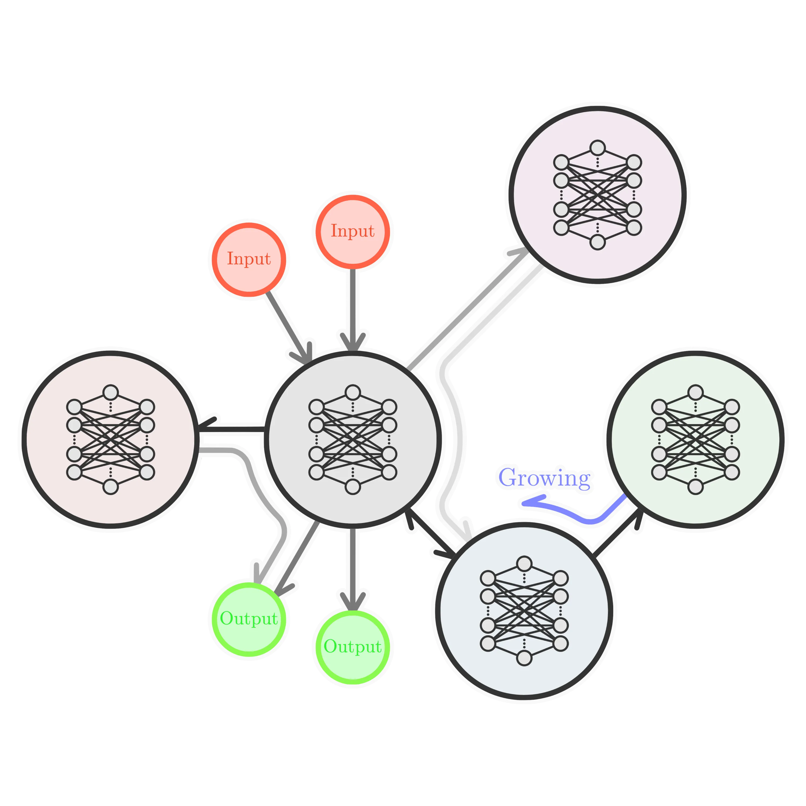

# 基于空间嵌入动态图与形态计算的具身人工生命协同发育研究
**Research on Morphological-Neural Co-development of Embodied Artificial Life based on Spatially-Embedded Dynamic Graphs**

## 1. 摘要 (Abstract)

当前主流的具身智能大多被构建为从输入到输出的静态映射, 机器人的躯壳与控制网络往往被割裂设计. 本研究计划希望回归人工生命 (ALife) 的核心理念: 摒弃过度的人为工程预设, 探索行为模式与物理特征如何从无到有地涌现 (Emergence). 我们认为, **智能是生命在开放演化与环境深度交融中产生的副产物, 而非预设的终点**.

本研究提出一种基于**空间嵌入动态有向图 (Spatially-Embedded Dynamic Graphs)** 的演化框架. 通过引入具有真实物理尺寸、传输延迟与能量代谢约束的数据结构, 结合复合模式生成网络 (CPPN) 的动态表达, 打破传统基因型到表现型的静态单射. 最终, 依托申请人在机电系统与底层硬件架构的工程经验, 本项目计划构建一套基于分布式 MCU 与总线通信的模块化物理系统, 将仿真中发育出的拓扑结构直接映射为物理实体, 验证**形态计算 (Morphological Computation)** 的价值, 完成从数字生命到具身物种的 Sim2Real 跨越.

## 2. 研究背景与核心动机 (Background & Motivation)

回顾生物进化史, 神经系统的诞生源于巧合与环境的物理约束. “雪球地球”时期钙离子的富集促成了离子通道的出现, 为神经冲动提供了物理基础. 真实的生物系统具有显著的**空间尺度**与**时域动态性**, 能够通过环路自激产生短期记忆与自发行为. 

然而, 当前的人工神经网络及其衍生的人工生命模型存在显著局限:
1. **拓扑与物理空间的割裂:** 传统的图结构仅表示逻辑连接, 缺乏“尺寸”与“物理分布”概念; 而神经元胞自动机 (NCA) 虽有空间感, 但受限于刚性网格, 难以模拟生物分裂时的三维延展与互相挤压.
2. **基因表达的确定性:** 在传统 CPPN 或 HyperNEAT 方案中, 表现型网络是瞬间生成的静态结构, 缺乏受外部环境刺激而产生的动态发育过程.
3. **难以逾越的具身鸿沟 (Embodiment Gap):** 机器人学通常先制造躯壳, 再强加“大脑”. 这种范式忽略了**形态计算**的重要价值——即躯体的物理结构本身就承担了一部分计算和环境适应功能.

为此, 本研究致力于构建一个不仅能在虚拟环境中演化, 更能平滑迁移至真实物理世界的具身生命生成框架.

## 3. 核心机制设计 (Methodology)

本研究将通过三个维度的机制设计, 实现从细胞演化到物理具身的系统构建.

### 3.1 生命的拓扑表示: 空间嵌入动态图 (Spatially-Embedded Dynamic Graph)

为了在计算机中准确表示带有物理边界与尺寸的生命实体, 突破纯逻辑图与死板体素的限制, 本研究设计了一种特化的数据结构: 将细胞或躯体模块视作节点, 节点间的物理连接使用带有空间属性的有向边表示.

在工程实现上, 采用**节点字典**与**稀疏邻接列表**的解耦架构:
- **节点字典 (Node Dictionary):** $\boldsymbol{\mathcal{V}} = \{\boldsymbol{v}_1, \boldsymbol{v}_2, ..., \boldsymbol{v}_N\}$, 存储节点状态、环境特征与空间坐标.
- **邻接列表 (Adjacency List):** $\boldsymbol{\mathcal{E}} = \{\boldsymbol{e}_{ij}\}$, 记录单向连接关系、物理距离 ($\Delta x_{ij}$) 与连接极性.

<figure style="text-align: center;">
  
  <figcaption style="font-size: 0.9em; color: grey;">图 1: 具有物理距离与连接极性的空间动态图拓扑实例</figcaption>
</figure>

这种数据结构允许在生命发育 (细胞分裂) 时动态插入新节点, 并通过物理距离的重算, 自然模拟生物组织生长时的拉伸力与挤压感, 为后续映射到具有真实尺寸的机器人关节模块提供基础.

### 3.2 物理约束下的内部动力学 (Internal Dynamics under Physical Constraints)

传统 ANN 缺乏真实物理世界的隐性限制. 本系统将引入生物学启发的时间累积与衰减效应, 使得图结构即使在外部刺激消失时, 也能维持内部的“环路自激”, 初步涌现出短期记忆.

定义节点 $i$ 在 $t$ 时刻的两个核心状态量: **膜电位累积值 ($U_i^{(t)}$)** 与 **可用囊泡/能量储备 ($R_i^{(t)}$)**.

**1. 信号传递与空间延迟:**
信号的传递不再是瞬时的, 而是受限于图拓扑中的物理距离 $\Delta d_{ji}$.
$$ U_i^{(t)} = U_i^{(t-1)}\cdot(1-\lambda) + \sum_{j\in \mathcal{N}(i)}S_j^{(t-\Delta t_{ji})} \cdot w_{ji} $$
其中, $\lambda$ 为膜电位自然衰减率, $\Delta t_{ji} \propto \Delta d_{ji}$ 为物理传输延迟, $w_{ji}$ 为兴奋/抑制权重.

**2. 能量代谢与恢复:**
$$ R_i^{(t)} = \min\left[ R_{\text{max}}, (R_i^{(t-1)}-\alpha_{\text{cost}}\cdot S_i^{(t-1)}+\beta_{\text{recover}}) \right] $$
其中, $\alpha_{\text{cost}}$ 为激发冲动消耗的能量/递质, $\beta_{\text{recover}}$ 为环境供给的自然恢复率.

**3. 阈值激发:**
$$ S_i^{(t)} = \begin{cases} 1, & \text{if } U_i^{(t)} \ge \theta_{\text{th}} \text{ and } R_i^{(t)} \ge \alpha_{\text{cost}} \\ 0, & \text{otherwise} \end{cases} $$

通过上述底层物理机制的限制, 人工生命的内部网络将告别纯粹的静态数学映射, 演变为一个具有节律性、易损性和内稳态的动态系统.

### 3.3 基因型与协同发育生成 (Morphological-Neural Co-development)

系统将采用 CPPN 作为状态转移函数 $F$. 演化始于一个受精卵节点, CPPN 接收节点的局部拓扑参数与环境信息素向量, 输出新节点的生成策略与突触建立方向.

**涌现特征预期:**
由于新的连接建立依赖于图中现存的物理路径 (类似于现实中的接触引导现象), 我们预期网络会自然演化出类似“喉返神经”的**神经束化 (Fasciculation)** 现象与大量**环状拓扑 (Recurrent Loops)**, 从而为复杂行为提供结构支撑. 此外, 演化的驱动力不再是单一的任务打分, 而是基于**内稳态 (Homeostasis)**——系统在多模态环境扰动下, 维持能量代谢网络不崩溃的存活时间, 以此实现更接近自然的开放演化.

## 4. 具身化与 Sim2Real 映射方案 (Embodiment and Sim2Real)

这是本研究有别于纯软件 ALife 研究的核心环节. 基于申请人丰富的机电系统集成与底层 Linux/嵌入式开发经验, 我们将把抽象的图拓扑降维并映射到真实物理世界.

1. **分布式硬件库的构建:**
   避免从零制造复杂机械结构, 计划采用标准化的参数化伺服模块 (如搭载力矩传感器的关节件) 作为“细胞节点”. 每个模块内部嵌入 MCU.
2. **总线拓扑等效神经通路:**
   放弃传统的“单一上位机集中计算”范式. 将仿真环境中存活的最优空间图个体的参数提取出来, 烧录至各个物理模块中. 模块间通过底层硬件总线 (如 CAN/RS485) 建立物理连接.
3. **物理觉醒 (Physical Awakening):**
   物理躯体通电后, 系统在逻辑上从“受精卵 (中枢模块)”开始启动. 随着 CPPN 规则在中枢内的重新表达, 网络顺着物理总线动态检索并连接各个关节 MCU, 将传感器输入与电机控制并入全局动态网络. 物理结构不仅承载计算, 其与真实地面的摩擦、重力阻尼都将作为隐式参数参与到系统的反射与决策中, 验证形态计算的最终闭环.

## 5. 预期贡献与评价指标 (Expected Contributions & Evaluation Metrics)

本研究不仅停留在理论探讨, 更着重于可测量的工程验证:
- **拓扑多样性与鲁棒性:** 量化测量基因型在不同噪声环境下生成的图编辑距离 (Graph Edit Distance). 引入随机切除模拟“物理损伤”, 观测系统的代谢恢复率与代偿行为.
- **虚实行为一致性 (Sim2Real Correlation):** 对比具身机器人在现实物理干扰下的响应模式与仿真模型的一致性, 证明“形态-神经协同发育”不仅具有观赏性, 更能在未知的真实环境中展现出优于传统 RL 固化策略的自发适应能力.

## 6. 研究时间表 (Timeline)

- **第 1-6 个月:** 开发并测试带有物理距离与代谢约束的“空间嵌入动态图”核心算法框架; 搭建仿真物理环境.
- **第 7-12 个月:** 运行大规模并行演化, 记录网络束化、环路形成与短期记忆的涌现过程; 验证形态发育算法的收敛性并撰写理论分析论文.
- **第 13-18 个月:** 基于商用关节模块与定制 MCU 板, 搭建包含 5-10 个节点的分布式物理硬件平台; 编写底层总线通信协议与神经映射中间件.
- **第 19-24 个月:** 开展 Sim2Real 部署实验, 在真实世界进行多模态刺激交互测试; 整理实验数据, 完成修士论文撰写与答辩.

---
**参考文献 (References)**

1. Stanley, K. O. (2007). Compositional pattern producing networks: A novel abstraction of development. *Genetic Programming and Evolvable Machines*.
2. Bongard, J. (2013). Evolutionary robotics. *Communications of the ACM*.
3. Levin, M. (2020). Morphological computation and the origins of cognition. *Nature Reviews Neuroscience*.
4. Mordvintsev, A., et al. (2020). Growing neural cellular automata. *Distill*.
5. Brooks, R. A. (1990). Elephants don't play chess. *Robotics and Autonomous Systems*. (经典具身认知理论)
6. Ikegami, T., & Suzuki, K. (2008). From a homeostatic to a homeodynamic self. *BioSystems*.